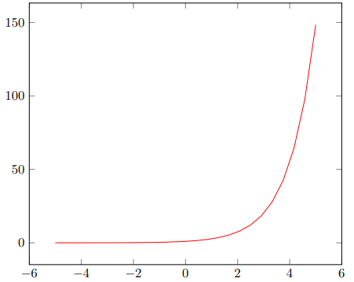
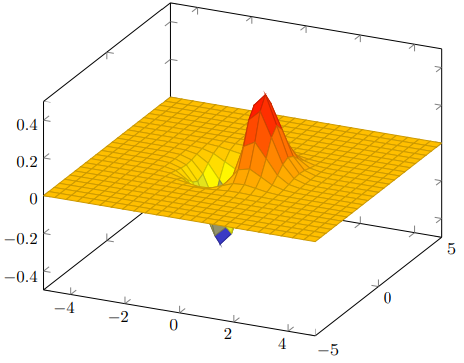
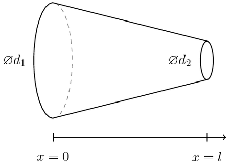
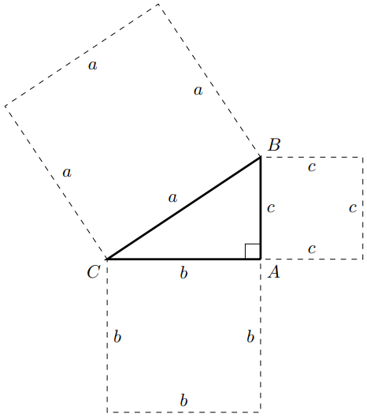
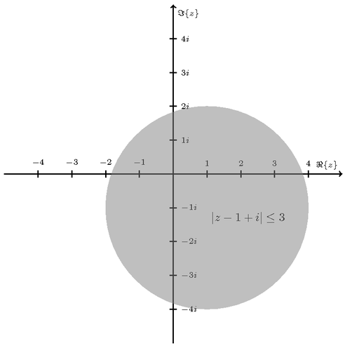
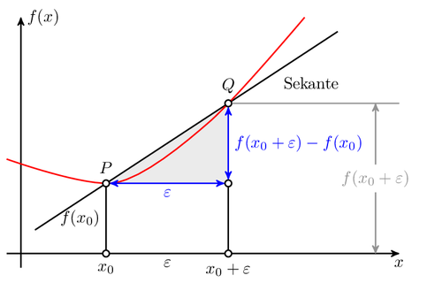
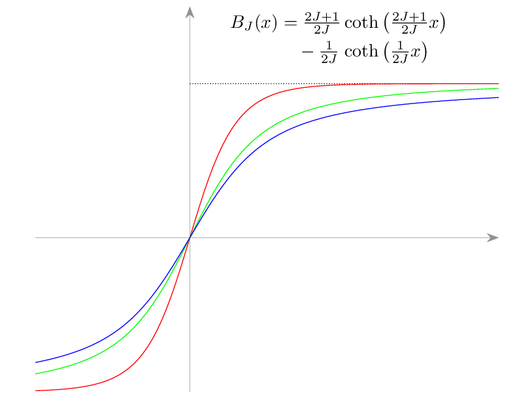
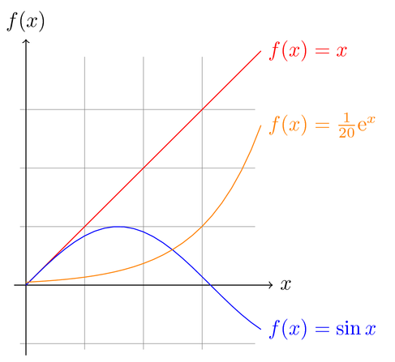

```{r setup, include=FALSE}
options(htmltools.dir.version = FALSE)
library(magick)
library(pdftools)
library(xfun)
```


layout: true
class: split-33

.column.bg-main1[.content[
  .split-three[
 .row[.content.center.vmiddle.reveal-text[
 # Why $\LaTeX{}$?
 ]]
  .row[.content.center.vmiddle.reveal-text[
  # $\TeX{}$
 ]]
   .row[.content.center.vmiddle.reveal-text[
  # $\LaTeX{}$
 ]]
 ]
]]

.column.bg-main1[.content.left.justificacion[
{{content}}
]]

???
Define the layout and for sequence hide the appropriate cell.

---

class: hide-row2-col1 hide-row3-col1 with-border

 $\LaTeX{}$<sup>1</sup> is an incredible tool created mainly for writing scientific manuscripts or simply text with a professional look, without the rigidity that offer other programs like the hated and also loved Microsoft Word, there's no middle ground regarding this program, either you hated it or you love it, I suppose that you know some LaTeX and that's why you are reading this, thus, you know that latex is not just for text, there is an infinite amount of things that you can do in LaTeX. This course is based on graphing, nevertheless, it never hurts to know more about its history before starting with the 2D graphing course. I cannot neglect to mention that I will be assuming that you have certain mathematical knowledge, I will not stop for explaining this regard, for instance, what a polynomial function is, how to find the roots of such polynomial function or proving the fundamental theorem of algebra, I will be focusing just in explaining how to use LaTeX for graphing pretty much everything... Let's begin.
 
 <span class="footnote" style="text-align:left"><sup>1</sup> This particual form for writing is done by using `$\LaTeX{}$`</span>

---

class: hide-row1-col1 hide-row3-col1 with-border 
count: false

I am sure that you have heard a lot about LaTeX, but not about $\TeX{}$<sup>2</sup>, but what's TeX? Well, long story short, it is the tool which was used for building Latex, that is, we could say that when we execute an instruction in LaTeX, TeX interprets it and generates what we need, TeX was developed in 19xx after 8 years of work by the great [Donald Knuth](https://en.wikipedia.org/wiki/Donald_Knuth) because he thought (correctly) that he needed better tipographic lenguages for developping scientific publishing, having that into account, Knuth started writing TeX for he felt upset with the decresing tipographic quality of the first to thrid volumes of his work "The Art of Computer Programming". For the latest reason, Knuth started to build his own typographic language, he thought that he could finish it in his sabbatical year, in 1978 to be specific; he was mistaken only by eight years. LaTeX was finally finished and frozen (no more modifications were made) around 1985.

The first TeX version was written using [SAIL programming lenguage](https://en.wikipedia.org/wiki/SAIL_(programming_language)) which was executed in a [PDP-10](https://en.wikipedia.org/wiki/PDP-10) in the operating system WAITS of Stanford University. For the following TeX versions, Knuth invented the concept of [literate programming](https://en.wikipedia.org/wiki/Literate_programming), this represents a form of producing compiled source code and documentation with high quality references (written in TeX, of course) starting from the original file. The used language was called WEB and produces programs in [Pascal](https://en.wikipedia.org/wiki/Pascal_(programming_language)).

 <span class="footnote" style="text-align:left"><sup>2</sup> This particual way of writing is done by using `$\TeX{}$`</span>
 
---

class: hide-row1-col1 hide-row2-col1 with-border
count: false

On the other hand, LaTeX was created in 1984 by [Leslie Lamport](https://en.wikipedia.org/wiki/Leslie_Lamport) as a set of TeX frames and, ever since, little by little the community has been updating it, so far we are in latex2e<sup>3</sup> version. The official definition of LaTeX is a high quality typographic composition system; it includes functionalities designed for the production of scientific and technical documents, although, LaTeX does not represent only that, we can create animation and embed video. We have to remark that the purists do not say that LaTeX is a programming language, however, a small part of the connoisseurs do consider LaTeX as a programming language. 

Using LaTeX we can separate the design of the document from the content in two different files. Someone in particular can write the content in despite establishing the design in the process. Using LaTeX, an author can work with a text editor, writing and specifying the structures of a page. LaTeX does the typographic composition during compiling in order to deal with the appearance of the document. Futhermore, The previous splitting processes make it easier for the users for them to get focus both in the style as well as the content individually.

LaTeX offers any sort of solution for any user. There are packages of any kind and for all tastes, these packages are free and they are designed for simplifying any kind of complex task. For instance, let us have in consideration the [Bibtex](https://en.wikipedia.org/wiki/BibTeX) package, which is highly efficient for the main LaTeX users who work in academic fields and research institutes. LaTeX offers bibliographic management for a better article representation. [Tikz and PGFPlots](https://en.wikipedia.org/wiki/PGF/TikZ) allow any kind of 2D or 3D graphics and block diagrams. There are also a great variety of packages for composing musical sheets, creating crossword puzzles, it provides packages for chemical elements, programming languages, animation, etc.

The majority of people use [Word](https://en.wikipedia.org/wiki/Microsoft_Word) for writing and managing the format of a file that contains several pages. Unfortunately, Word will not offer a great experience for many users. Now, using LaTeX, we can divide huge documents in many little fragments that, later on, can be added automatically for LaTeX. Besides, LaTeX allows the users to create bibliography very easily, index and content tables in may files.

Apart from all the other brilliant functionalities, we have to remark that LaTeX is completely free.

<!-- para seguir animandote te mostrare a continuacion cosas que podras lograr al final de este curso -->


 <span class="footnote" style="text-align:left"><sup>3</sup> For knowing more about the project, visit its [official page](https://www.latex-project.org/) or its [official repository](https://github.com/latex3/latex2e)</span>
---


layout: false

class: bg-main1 center middle hide-slide-number

.reveal-text.bg-main2[.pad1[
.font4.center[Tikz y PGFPlots]
]]

---
layout: true
class: split-33

.column.bg-main1[.content[
  .split-three[
 .row[.content.center.vmiddle.reveal-text[
 # PGF
 ]]
  .row[.content.center.vmiddle.reveal-text[
  # TikZ
 ]]
   .row[.content.center.vmiddle.reveal-text[
  # PGFPlots
 ]]
 ]
]]

.column.bg-main1[.content.left.justificacion[
{{content}}
]]

???
Define the layout and for sequence hide the appropriate cell.

---

class: hide-row2-col1 hide-row3-col1 with-border

What is PGF? We do not need to know a lot about this, this is because we will not use it directly, however, it is always good to know the terminology that involves our study, in general terms, we can say that PGF is the basis of TikZ<sup>4</sup>, PGF is a low level programming language and it is the acronym for "Portable Graphics Format". PGF was created by [Till Tantau](https://www.tcs.uni-luebeck.de/mitarbeiter/tantau/).

In Till own words, he said:

> TikZ started out as a project to implement TEX graphics macros that can be used both with [pdfLATEX](http://www.math.rug.nl/~trentelman/jacob/pdflatex/pdflatex.html) and also with the classical
([PostScript-based](https://en.wikipedia.org/wiki/PostScript)) LATEX. In other words, I wanted to implement a “portable graphics format” for TEX – hence the name pgf. These early macros are still around and they form the “basic layer” of the system described in this manual, but most of the interaction an author has theses days is with TikZ – which has become a whole language of its own.

 <span class="footnote" style="text-align:left"><sup>4</sup> TikZ was incorporated in PGF 1.10 version</span>

---

class: hide-row1-col1 hide-row3-col1 with-border 
count: false

TikZ was also created by [Till Tantau](https://www.tcs.uni-luebeck.de/mitarbeiter/tantau/) and included in a following version of PGF, TikZ is an acronym for "TikZ ist kein Zeichenprogramm". TikZ is not the only LaTeX package for generating graphics, but it is definitely the most used and powerful and, for our concern, we will be using TikZ exclusively, this is because is the only layout that allows the user to interact with PGF in a friendly manner.


 
---

class: hide-row1-col1 hide-row2-col1 with-border
count: false

PGF?, luego TIkZ, y ahora PGFPlots? ok, puede ser un poco confuso, vamos a recapitular. PGF es la base de todo TikZ. y PGFPlots esta basado en TikZ, Entonces cual usar? basicamente PGFPlots proporciona un ayuda considerable al momento de generar graficas utilizando formulas, o datos de entrrada y PGFPplots se encargada de el resto. Por Ejemplo, intentemos graficar $e^x$ 

```{}
\begin{tikzpicture}
\begin{axis}
\addplot[color=red]{exp(x)};
\end{axis}
\end{tikzpicture}
```

<div style="float:left;position: relative; padding:10px;width: 55%">
```{r, echo=FALSE, fig.cap="Grafico de $e^x$", out.width = '100%'}

```
</div>
Notamos que en el pequeno fragmento que no importa que no entiendas del todo en estos momentos, pero basicamente expcribimos la expresion explicitamente y PGFPlots se encarga de graficarla, incluso los ejes coordenados, este es el poder y la simplicidad que buscamos al momento de generar graficas de funciones y es una ventaja con respecto TikZ Puro.


---

class: hide-row1-col1 hide-row2-col1 with-border
count: false

Vamos a intentar graficar algo en tres dimension:

```{}
\begin{tikzpicture}
\begin{axis}
\addplot3[
    surf,
]
{exp(-x^2-y^2)*x};
\end{axis}
\end{tikzpicture}
```

<div style="float:left;position: relative; padding:10px;width: 55%">
```{r, echo=FALSE, fig.cap="Grafico de $xe^{-x^2-y^2}$", out.width = '100%'}

```
</div>
Claro que podemos aprovechar esto para funciones en `tres dimension` en este caso graficamos la funcion. $xe^{-x^2-y^2}$

---

layout: false
class: bg-main1 center middle hide-slide-number

.reveal-text.bg-main2[.pad1[
.font4.center[Examples]
.font2.center[Voy a mostrar algunos ejemplos que aprenderas aqui en el curso.]
]]
---

layout: true
class: split-33 with-border

.column[
  .split-five[
  .row.bg-main1[.content.center.vmiddle[
# Angulos
  ]]
  .row.bg-main2[.content.center.vmiddle[
# Geometria
  ]]
  .row.bg-main3[.content.center.vmiddle[
# Complex Plane
  ]]
  .row.bg-main5[.content.center.vmiddle[
# Multiple Plots
  ]]
  .row[.content.center.vmiddle[
# Basics Plots
  ]]
]]

.column[.content.left.justificacion[
{{content}}
]]


---

class: hide-row2-col1 hide-row3-col1 hide-row4-col1 hide-row5-col1 with-border bg-main1

```{}
% Truncated Cone
% Author: Mathias Magdowski
\documentclass{article}
\usepackage{tikz}
\usetikzlibrary{calc}
\usepackage{amssymb}

\begin{document}
\begin{tikzpicture}
	\draw[dashed,color=gray] (0,0) arc (-90:90:0.5 and 1.5);% right half of the left ellipse
	\draw[semithick] (0,0) -- (4,1);% bottom line
	\draw[semithick] (0,3) -- (4,2);% top line
	\draw[semithick] (0,0) arc (270:90:0.5 and 1.5);% left half of the left ellipse
	\draw[semithick] (4,1.5) ellipse (0.166 and 0.5);% right ellipse
	\draw (-1,1.5) node {$\varnothing d_1$};
	\draw (3.3,1.5) node {$\varnothing d_2$};
	\draw[|-,semithick] (0,-0.5) -- (4,-0.5);
	\draw[|->,semithick] (4,-0.5) -- (4.5,-0.5);
	\draw (0,-1) node {$x=0$};
	\draw (4,-1) node {$x=l$};
\end{tikzpicture}
\end{document}
```

```{r, echo=FALSE,fig.align='center', fig.cap= "The graphic shows a truncated cone. The diameter of the cone changes from $d_1$ to $d_2$ along the x-direction.",out.width = '50%'}

```
<br>
---

class: hide-row3-col1 hide-row4-col1 hide-row5-col1 with-border bg-main1
count: false

```{}
% Pythagorean triangle with the squares
% Author: Alex Chan
\documentclass{article}
\usepackage{tikz}
\newcommand{\pythagwidth}{3cm}
\newcommand{\pythagheight}{2cm}

\begin{document}
\begin{tikzpicture}
  \coordinate [label={below right:$A$}] (A) at (0, 0);
  \coordinate [label={above right:$B$}] (B) at (0, \pythagheight);
  \coordinate [label={below left:$C$}] (C) at (-\pythagwidth, 0);
  
  \coordinate (D1) at (-\pythagheight, \pythagheight + \pythagwidth);
  \coordinate (D2) at (-\pythagheight - \pythagwidth, \pythagwidth);
  
  \draw [very thick] (A) -- (C) -- (B) -- (A);
  
  \newcommand{\ranglesize}{0.3cm}
  \draw (A) -- ++ (0, \ranglesize) -- ++ (-\ranglesize, 0) -- ++ (0, -\ranglesize);
  
  \draw [dashed] (A) -- node [below] {$b$} ++ (-\pythagwidth, 0)
          -- node [right] {$b$} ++ (0, -\pythagwidth)
          -- node [above] {$b$} ++ (\pythagwidth, 0)
          -- node [left]  {$b$} ++ (0, \pythagwidth);
          
  \draw [dashed] (A) -- node [right] {$c$} ++ (0,\pythagheight)%
          -- node [below] {$c$} ++ (\pythagheight, 0)
          -- node [left]  {$c$} ++ (0, -\pythagheight)
          -- node [above] {$c$} ++ (-\pythagheight, 0);
          
  \draw [dashed] (C) -- node [above left]  {$a$} (B)
          -- node [below left]  {$a$} (D1)
          -- node [below right] {$a$} (D2)
          -- node [above right] {$a$} (C);
\end{tikzpicture}
\end{document}
```

```{r, echo=FALSE,fig.align='center', fig.cap= "Pythagorean triangle with the squares of its sides and labels",out.width = '37%'}

```
---

class: hide-row4-col1 hide-row5-col1 with-border bg-main1
count: false

```{}
% Drawing a circle in the complex plane
% Author: Martin Scharrer
\documentclass{article}
\usepackage{tikz}
\begin{document}
\begin{tikzpicture}
    \begin{scope}[thick,font=\scriptsize]
    % Axes:
    % Are simply drawn using line with the `->` option to make them arrows:
    % The main labels of the axes can be places using `node`s:
    \draw [->] (-5,0) -- (5,0) node [above left]  {$\Re\{z\}$};
    \draw [->] (0,-5) -- (0,5) node [below right] {$\Im\{z\}$};

    % Axes labels:
    % Are drawn using small lines and labeled with `node`s. The placement can be set using options
    \iffalse% Single
    % If you only want a single label per axis side:
    \draw (1,-3pt) -- (1,3pt)   node [above] {$1$};
    \draw (-1,-3pt) -- (-1,3pt) node [above] {$-1$};
    \draw (-3pt,1) -- (3pt,1)   node [right] {$i$};
    \draw (-3pt,-1) -- (3pt,-1) node [right] {$-i$};
    \else% Multiple
    % If you want labels at every unit step:
    \foreach \n in {-4,...,-1,1,2,...,4}{%
        \draw (\n,-3pt) -- (\n,3pt)   node [above] {$\n$};
        \draw (-3pt,\n) -- (3pt,\n)   node [right] {$\n i$};
    }
    \fi
    \end{scope}
    % The circle is drawn with `(x,y) circle (radius)`
    % You can draw the outer border and fill the inner area differently.
    % Here I use gray, semitransparent filling to not cover the axes below the circle
    \path [draw=none,fill=gray,semitransparent] (+1,-1) circle (3);
    % Place the equation into the circle:
    \node [below right,darkgray] at (+1,-1) {$|z-1+i| \leq 3$};
\end{tikzpicture}
\end{document}
```

```{r, echo=FALSE,fig.align='center', fig.cap= "Circle in the complex plane",out.width = '45%'}

```

---

class: hide-row5-col1 with-border bg-main1
count: false

```{}
% Linear regression
% Author: Henri Menke
\documentclass[tikz,border=10pt]{standalone}
\usetikzlibrary{arrows,intersections}
\begin{document}
\begin{tikzpicture}[
    thick,
    >=stealth',
    dot/.style = {
      draw,
      fill = white,
      circle,
      inner sep = 0pt,
      minimum size = 4pt
    }
  ]
  \coordinate (O) at (0,0);
  \draw[->] (-0.3,0) -- (8,0) coordinate[label = {below:$x$}] (xmax);
  \draw[->] (0,-0.3) -- (0,5) coordinate[label = {right:$f(x)$}] (ymax);
  \path[name path=x] (0.3,0.5) -- (6.7,4.7);
  \path[name path=y] plot[smooth] coordinates {(-0.3,2) (2,1.5) (4,2.8) (6,5)};
  \scope[name intersections = {of = x and y, name = i}]
    \fill[gray!20] (i-1) -- (i-2 |- i-1) -- (i-2) -- cycle;
    \draw      (0.3,0.5) -- (6.7,4.7) node[pos=0.8, below right] {Sekante};
    \draw[red] plot[smooth] coordinates {(-0.3,2) (2,1.5) (4,2.8) (6,5)};
    \draw (i-1) node[dot, label = {above:$P$}] (i-1) {} -- node[left]
      {$f(x_0)$} (i-1 |- O) node[dot, label = {below:$x_0$}] {};
    \path (i-2) node[dot, label = {above:$Q$}] (i-2) {} -- (i-2 |- i-1)
      node[dot] (i-12) {};
    \draw           (i-12) -- (i-12 |- O) node[dot,
                              label = {below:$x_0 + \varepsilon$}] {};
    \draw[blue, <->] (i-2) -- node[right] {$f(x_0 + \varepsilon) - f(x_0)$}
                              (i-12);
    \draw[blue, <->] (i-1) -- node[below] {$\varepsilon$} (i-12);
    \path       (i-1 |- O) -- node[below] {$\varepsilon$} (i-2 |- O);
    \draw[gray]      (i-2) -- (i-2 -| xmax);
    \draw[gray, <->] ([xshift = -0.5cm]i-2 -| xmax) -- node[fill = white]
      {$f(x_0 + \varepsilon)$}  ([xshift = -0.5cm]xmax);
  \endscope
\end{tikzpicture}
\end{document}
```

```{r, echo=FALSE,fig.align='center', fig.cap= "Linear regression",out.width = '45%'}

```

---
class: hide-row5-col1 with-border bg-main1
count: false

```{}
% Brillouin Function
% Author: Mark Wibrow
\documentclass[tikz,border=10pt]{standalone}
\usepackage{amsmath}
\usetikzlibrary{arrows.meta}
\directlua{
function coth (i) 
  return math.cosh(i) / math.sinh(i)
end

function brillouin (J, x) 
  if x == 0 then
    return 0
  else
   return (2*J+1)/(2*J)*coth((2*J+1)/(2*J)*x) - 
        1/(2*J)*coth(1/(2*J)*x)
  end
end
}
\pgfmathdeclarefunction{Brillouin}{2}{%
  \edef\pgfmathresult{%
     \directlua{tex.print("" .. brillouin(#1,#2))}%
   }%  
}
\begin{document}
\begin{tikzpicture}[
    x                = 2cm/10,
    scale            = 3,
    axis/.style      = {help lines, -{Stealth[length = 1.5ex]}},
    brillouin/.style = {domain = -5:10, samples = 100}
  ]
  \draw [axis] (-5,0) -- (10,0);
  \draw [axis] (0,-1) -- (0,1.5);
  \draw [densely dotted] (0,{ Brillouin(1, 100)} ) -- ++(10,0);
  \draw [red]   plot [brillouin] (\x, { Brillouin(1,  \x)});
  \draw [green] plot [brillouin] (\x, { Brillouin(5,  \x)});
  \draw [blue]  plot [brillouin] (\x, { Brillouin(50, \x)});
  \node [align = center, anchor = west] at (1,1.3) {%
    $\begin{alignedat}{2}
      B_J(x) &= \tfrac{2J + 1}{2J}
                &&\coth \left ( \tfrac{2J + 1}{2J} x \right ) \\
             &\quad - \tfrac{1}{2J}
                &&\coth \left ( \tfrac{1}{2J} x \right )
     \end{alignedat}$};
\end{tikzpicture}
\end{document}
```

```{r, echo=FALSE,fig.align='center', fig.cap= "Brillouin Function",out.width = '45%'}

```

---
class: bg-main1
count: false

En este Proximo ejemplo podremos apreciar la diferencia del `\addplot` del paquete en PGFPlots y la sentencia `\draw` dentro de Tikz, Los ejes coordenados entre otras cosas no se generan automaticamente utilizando TikZ puro 

```{}
% Author: Till Tantau
% Source: The PGF/TikZ manual
\documentclass{article}

\usepackage[latin1]{inputenc}
\usepackage{tikz}

% GNUPLOT required
\begin{document}
\pagestyle{empty}


\begin{tikzpicture}[domain=0:4]
    \draw[very thin,color=gray] (-0.1,-1.1) grid (3.9,3.9);
    \draw[->] (-0.2,0) -- (4.2,0) node[right] {$x$};
    \draw[->] (0,-1.2) -- (0,4.2) node[above] {$f(x)$};
    \draw[color=red] plot[id=x] function{x} 
        node[right] {$f(x) =x$};
    \draw[color=blue] plot[id=sin] function{sin(x)} 
        node[right] {$f(x) = \sin x$};
    \draw[color=orange] plot[id=exp] function{0.05*exp(x)} 
        node[right] {$f(x) = \frac{1}{20} \mathrm e^x$};
\end{tikzpicture}


\end{document}
```

```{r, echo=FALSE,fig.align='center', fig.cap= "Graficas de $f(x)=x$, $f(x)=e^x$, $f(x)=sin(x)$",out.width = '34%'}

```
<br>
---

layout: false

class: bg-main1 center middle hide-slide-number

.reveal-text.bg-main2[.pad1[
.font4.center[The End]
]]


