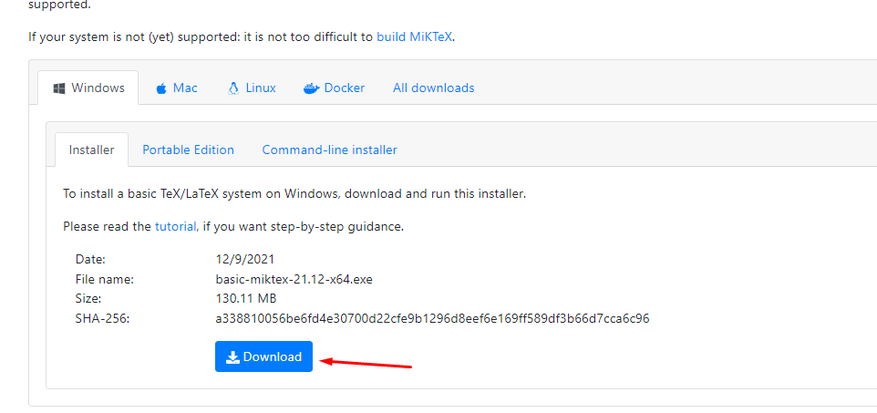
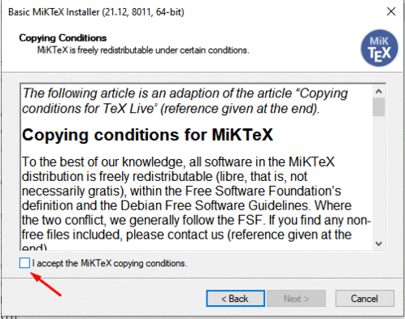
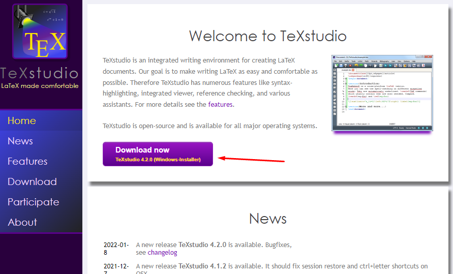
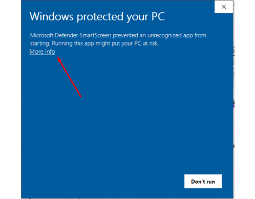
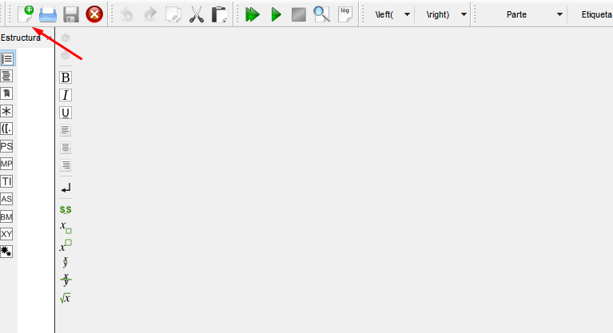
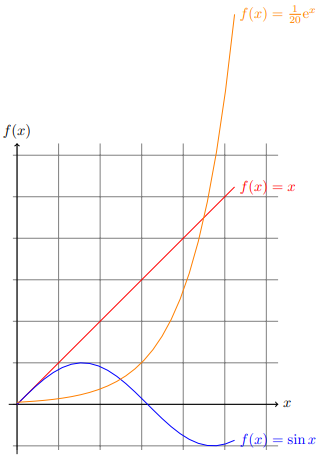
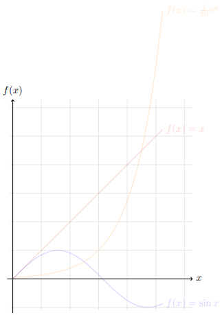
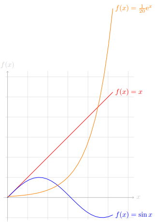

```{r setup, include=FALSE}
options(htmltools.dir.version = FALSE)
library(magick)
library(pdftools)
library(xfun)
```

class: bg-main1 center middle hide-slide-number

.reveal-text.bg-main2[.pad1[
.font4.center[Installation]
]]

---

layout: true
class: split-20 with-border

.column[
  .split-four[
  .row.bg-main1[.content.center.vmiddle.reveal-text[
# Tools
  ]]
  .row.bg-main2[.content.center.vmiddle.reveal-text[
# Windows
  ]]
  .row.bg-main3[.content.center.vmiddle.reveal-text[
# Linux
  ]]
  .row.bg-main5[.content.center.vmiddle.reveal-text[
# macOS
  ]]
]]

.column[.content.left.justificacion[
{{content}}
]]


---

class: hide-row2-col1 hide-row3-col1 hide-row4-col1 with-border bg-main1

#### `Packages`

Let's remember that $\LaTeX$ is a set of $\TeX$ instructions, therefore, we need to know some things before starting, in this way, we need to define how we like to work

#### `In the Cloud`

A very popular option for beginners in LaTeX is the option to use the cloud, the best platform today is [OverLeaf](www.overleaf.com), it has its own tutorials, thousands of templates, you can work as a team with other editors in latex, among many other positive things that Cloud technology offers us

#### `Local Environment`

Depending on your operating system, the way to install $\LaTeX$ may vary, however, we will always need to download and install all the packages to be able to use LaTeX. Currently there is a basic version and a full version.

Later, we should install an [IDE](https://en.wikipedia.org/wiki/Integrated_development_environment), to work in a more friendly way, since the [IDE](https://en.wikipedia.org/wiki/ Integrated_development_environment) that comes by default is quite archaic and may not be liked by everyone, in my opinion, the one that I like the most and that I have always used is [TeXstudio](https://www.texstudio.org/) another one that is has become quite popular is the [IDE](https://en.wikipedia.org/wiki/Integrated_development_environment) [LyX](https://www.lyx.org/) , which I must admit is good, but in my opnion, I do not recommend it since, although it promises to write documents in [WYSIWYM](https://en.wikipedia.org/wiki/WYSIWYM) format, it has its technical disadvantages, since it hides many of the most powerful features that the environment $\LaTeX$ offers and therefore, you will not know what happens behind the scenes.

I will leave you here a [List of Editors of $\TeX$](https://en.wikipedia.org/wiki/Comparison_of_TeX_editors) with each of the characteristics

#### `PDF`

One of the ultimate goals is to be able to create your precious [PDF](https://en.wikipedia.org/wiki/PDF). Thus, it may seem obvious but you also need a [PDF](https://en.wikipedia.org/wiki/PDF) reader.

---

class: hide-row2-col1 hide-row3-col1 hide-row4-col1 with-border bg-main1

#### `References`

For more advanced users (or for more elaborate documents) we have tools for the use of references, one of the most famous is [JabRef](https://www.jabref.org/). Tthe aforementioned tool allows us to generate, save, update and document our references, however, in order for Latex to be able to use it properly, we will need to include some of the LaTeX libraries that exist for handling and formatting references in the final [PDF](https:/ /en.wikipedia.org/wiki/PDF).

#### `Other`

Many people don't know it but Latex can generate other types of files such as [.ps](https://en.wikipedia.org/wiki/PostScript), for the latter we have [GPL Ghostscript and GSview](http://pages .cs.wisc.edu/~ghost/). and there is also [Dia](http://dia-installer.de/index.html.es) which is a very simple program to make images directly in [.eps](https://en.wikipedia.org/wiki /Encapsulated_PostScript)

#### `Operating Systems`
Obviously latex packages are available for all operating systems

---

class: hide-row1-col1 hide-row3-col1 hide-row4-col1 with-border bg-main1
count: false

Let's begin to install each of the tools to correctly use $\LaTeX$ in [Windows](https://en.wikipedia.org/wiki/Microsoft_Windows)

For this operating system there is [`MikTeX`](https://en.wikipedia.org/wiki/MiKTeX)

**Step 1)** Download through this [link](https://miktex.org/download). I recommend the basic 64 bits version, since it contains everything we need
```{r, echo=FALSE,fig.align='center',out.width = '40%'}

```

**Step 2)** We proceed with the installation, which is quite standard, we just have to take into account that at one point it will ask you if we want to install the packages directly from the cloud, to which we proceed affirmatively, and then we continue with ``next'' .

```{r, echo=FALSE,fig.align='center',out.width = '35%'}

```

---

class: hide-row1-col1 hide-row3-col1 hide-row4-col1 with-border bg-main1
count: false

**Step 3)** Downloading the [IDE](https://en.wikipedia.org/wiki/Integrated_development_environment), the one I will use is [TeXstudio](https://www.texstudio.org/), for this, we go to this [link ](https://github.com/texstudio-org/texstudio/releases/download/4.2.0/texstudio-4.2.0-win-qt6.exe)
```{r, echo=FALSE,fig.align='center',out.width = '35%'}

```
**Step 4)** Installation is even easier (although Windows alarms may throw you a warning, but don't worry, it's just protocol), as it is shown below:
```{r, echo=FALSE,fig.align='center',out.width = '35%'}

```
---

class: hide-row1-col1 hide-row3-col1 hide-row4-col1 with-border bg-main1
count: false

**Step 5)** We are going to check our installation, we are going to use a small piece of code to generate a basic pdf

```{}
\documentclass{article} % Starts an article
\usepackage{amsmath} % Imports amsmath
\title{\LaTeX} % Title

\begin{document} % Begins a document
  \maketitle
  \LaTeX{} is a document preparation system for
  the \TeX{} typesetting program. It offers
  programmable desktop publishing features and
  extensive facilities for automating most
  aspects of typesetting and desktop publishing,
  including numbering and  cross-referencing,
  tables and figures, page layout,
  bibliographies, and much more. \LaTeX{} was
  originally written in 1984 by Leslie Lamport
  and has become the  dominant method for using
  \TeX; few people write in plain \TeX{} anymore.
  The current version is \LaTeXe.

  % This is a comment, not shown in final output.
  % The following shows typesetting  power of LaTeX:
  \begin{align}
    E_0 &= mc^2 \\
    E &= \frac{mc^2}{\sqrt{1-\frac{v^2}{c^2}}}
  \end{align} 
\end{document}
```
Copy this code and create a blank sheet, paste the code on the file and then press `F5` button to generate our PDF.
```{r, echo=FALSE,fig.align='center',out.width = '40%'}

```
If we can see the compiled document on our right, then everything is fine, if not, if you have some errors, you can send me a message. I will not focus too much on the use of the IDE because it's really quite common: Create new document, compile, delete document, save, etc.
---
class: hide-row1-col1 hide-row2-col1 hide-row4-col1 with-border bg-main1
count: false

Let's start installing each of the tools to correctly use $\LaTeX$ on [Linux](https://en.wikipedia.org/wiki/Linux). The use of the terminal in this type of operating system can give the impression that it is even more complex to install programs, however, in my opinion, it is way easier. If you are a frequent user of these operating systems, I suppose you know that their installation methods usually vary, I will only focus on the four methods that I consider that they are mostly used. To proceed with the verification, we proceed as explained in the Windows slides

For [Debian ](https://www.debian.org/index.en.html) and [Ubuntu](https://ubuntu.com/):

```{}
# apt-get update
# apt-get install texlive texlive-base
```
If you want the full $\LaTeX$ package run (Muchos GB de paquetes)
```{}
# apt-get install texlive-full
```

[Fedora](https://getfedora.org/):
```{}
# yum install texlive texlive-latex
```
[ArchLinux](https://archlinux.org/):
```{}
# pacman -S texlive-most
```
for installing [TeXstudio](https://www.texstudio.org/) in [Debian ](https://www.debian.org/index.en.html) and [Ubuntu](https://ubuntu.com/):
```{}
# apt-get install texstudio
```
[Fedora](https://getfedora.org/) and [ArchLinux](https://archlinux.org/) respectively:
```{}
# yum install texstudio
```

```{}
# pacman -S texstudio
```
---

class: hide-row1-col1 hide-row2-col1 hide-row3-col1 with-border bg-main1
count: false

For $\LaTeX$ users on [macOS](https://en.wikipedia.org/wiki/MacOS) you can go to the following [Official](https://tug.org/mactex/)

To install [TeXstudio](https://www.texstudio.org/) we must go to this [link](https://github.com/texstudio-org/texstudio/releases/download/4.2.0/texstudio-4.2 .0-osx.dmg)
<br>
---
layout: false
class: bg-main1 center middle hide-slide-number

.reveal-text.bg-main2[.pad1[
.font4.center[Parts of a LaTeX Document]
]]
---
layout: true
class: split-20 with-border

.column[
  .split-two[
  .row.bg-main1[.content.center.vmiddle.reveal-text[
# Preamble
  ]]
  .row.bg-main2[.content.center.vmiddle.reveal-text[
# Entorno<br>Documento
  ]]
]]

.column[.content.left.justificacion[
{{content}}
]]


---

class: hide-row2-col1 with-border bg-main1

Before we start diving fully into the world of PGFPlots/TIKZ, we must first understand (line by line) a basic $\LaTeX$ document, for that, we will use the following code:

```{}
\documentclass{article}
\usepackage{amsmath}
\usepackage{tikz}
\begin{document}
	\begin{tikzpicture}[domain=0:5*pi/3] 
		\draw[very thin,color=gray] (-0.1,-1.1) grid (2*pi,2*pi);
		\draw[->] (-0.2,0) -- (2*pi,0) node[right] {$x$}; 
		\draw[->] (0,-1.2) -- (0,2*pi) node[above] {$f(x)$};
		\draw[color=red]    plot (\x,\x)             node[right] {$f(x) =x$}; 
		\draw[color=blue]   plot (\x,{sin(\x r)})    node[right] {$f(x) = \sin x$}; 
		\draw[color=orange] plot (\x,{0.05*exp(\x)}) node[right] {$f(x) = \frac{1}{20} \mathrm e^x$};
	\end{tikzpicture}
\end{document}
```
The first thing we have to know is the preamble where we make all the changes, where we import libraries and generate the kind of documents we want, we can even create slides, all this is done from the preamble, which represents everything that goes before the line `\begin{document}`
---

class: hide-row2-col1 with-border bg-main1


```{latex,eval=F}
{{\documentclass{article}}}
{{\usepackage{amsmath}}}
{{\usepackage{tikz}}}
\begin{document}
	\begin{tikzpicture}[domain=0:5*pi/3] 
		\draw[very thin,color=gray] (-0.1,-1.1) grid (2*pi,2*pi);
		\draw[->] (-0.2,0) -- (2*pi,0) node[right] {$x$}; 
		\draw[->] (0,-1.2) -- (0,2*pi) node[above] {$f(x)$};
		\draw[color=red]    plot (\x,\x)             node[right] {$f(x) =x$}; 
		\draw[color=blue]   plot (\x,{sin(\x r)})    node[right] {$f(x) = \sin x$}; 
		\draw[color=orange] plot (\x,{0.05*exp(\x)}) node[right] {$f(x) = \frac{1}{20} \mathrm e^x$};
	\end{tikzpicture}
\end{document}
```
In the preamble, as we can notice, we can read the lines of code that are highlighted.

---

class: hide-row2-col1 with-border bg-main1


```{latex,eval=F}
{{\documentclass{article}}}
\usepackage{amsmath}
\usepackage{tikz}
\begin{document}
	\begin{tikzpicture}[domain=0:5*pi/3] 
		\draw[very thin,color=gray] (-0.1,-1.1) grid (2*pi,2*pi);
		\draw[->] (-0.2,0) -- (2*pi,0) node[right] {$x$}; 
		\draw[->] (0,-1.2) -- (0,2*pi) node[above] {$f(x)$};
		\draw[color=red]    plot (\x,\x)             node[right] {$f(x) =x$}; 
		\draw[color=blue]   plot (\x,{sin(\x r)})    node[right] {$f(x) = \sin x$}; 
		\draw[color=orange] plot (\x,{0.05*exp(\x)}) node[right] {$f(x) = \frac{1}{20} \mathrm e^x$};
	\end{tikzpicture}
\end{document}
```
The `\documentclass{article}` line establishes the document class, there are many classes, we can even define classes ourselves, but it is a topic that exceeds the content of this course. Among the most used classes we can see the following:

* `article` for articles in scientific journals, presentations, short reports, program documentation, invitations, ...
* `report` for longer reports containing several chapters, small books, thesis, ...
* `book` for real books
* `beamer` For writing presentations.
* `standalone` bundle allows users to easily place picture environments or other material in own source files and compile these on their own or as part of a main document. A special standalone class is provided for use with such files, which by default crops the resulting output file to the content

I must say that each one can receive its own characteristics as parameters to be modified within `[...]`

For example `\documentclass[12pt,twocolumn]{article}` sets a document class of type `article` with a font size of `12pt` and all pages will be `two column`

Another example is `\documentclass[twoside, openright]{report}`. `openright` always starts a chapter on the right (odd pages), leaving one page blank in case the last paragraph of the previous chapter ended on an odd page. It only works and makes sense with the twoside option set. The open any option starts the chapter on the next page (even or odd).

The `openany`, `openright` options are not available in article as it does not support `\chapter`!
---

class: hide-row2-col1 with-border bg-main1


```{latex,eval=F}
\documentclass{article}
{{\usepackage{amsmath}}}
{{\usepackage{tikz}}}
\begin{document}
	\begin{tikzpicture}[domain=0:5*pi/3] 
		\draw[very thin,color=gray] (-0.1,-1.1) grid (2*pi,2*pi);
		\draw[->] (-0.2,0) -- (2*pi,0) node[right] {$x$}; 
		\draw[->] (0,-1.2) -- (0,2*pi) node[above] {$f(x)$};
		\draw[color=red]    plot (\x,\x)             node[right] {$f(x) =x$}; 
		\draw[color=blue]   plot (\x,{sin(\x r)})    node[right] {$f(x) = \sin x$}; 
		\draw[color=orange] plot (\x,{0.05*exp(\x)}) node[right] {$f(x) = \frac{1}{20} \mathrm e^x$};
	\end{tikzpicture}
\end{document}
```
The other thing that we can see here is the instruction to import packages `\usepackage{...}`, there are literally thousands and thousands of latex packages that will allow us to do practically everything we can imagine, however, in this case, we are importing two packages, the package [amsmath](https://ctan.org/pkg/amsmath) is one of the most important since it contains everything related to mathematical typography (formulas, matrices, etc.), the other package that we are loading is our beloved [tikz](https://tikz.net/) who no longer needs an introduction...

Maybe in the future you have to make a report on [crossword puzzle](https://en.wikipedia.org/wiki/Crossword) and you have to generate one, then you should use the `cwpuzzle` package as follows ` \usepackage{crossword}` to be able to generate crosswords<sup>1</sup>
 
You can load as many packages as you want, if among the thousands of packages you don't find one that does what you need, you can always create one, although it is a fairly advanced topic

Obviously, this is not all we can do in the preamble, we can redefine global elements of our document, for example, If you don't want any indent, anywhere in your document, add `\setlength{\parindent}{0pt} ` in your document preamble.

Usually the title of the document and the date are also specified in the preamble. 
<span class="footnote" style="text-align:left"><sup>1</sup>If you really want to do a [crossword puzzle](https://en.wikipedia.org/wiki/Crossword) you can read the official documentation package `cwpuzzle` [here](http://mirrors.ctan.org/macros/latex/contrib/gene/crossword/cwpuzzle.pdf) and also a great explanation [here](https://tex.stackexchange.com/questions/44775/how-to-create-a-crossword-puzzle-in-latex) </span>
---

class: hide-row1-col1 with-border bg-main1
count: false

```{latex,eval=F}
\documentclass{article}
\usepackage{amsmath}
\usepackage{tikz}
{{\begin{document}}}
	{{\begin{tikzpicture}[domain=0:5*pi/3] }}
		{{\draw[very thin,color=gray] (-0.1,-1.1) grid (2*pi,2*pi);}}
		{{\draw[->] (-0.2,0) -- (2*pi,0) node[right] {$x$}; }}
		{{\draw[->] (0,-1.2) -- (0,2*pi) node[above] {$f(x)$};}}
		{{\draw[color=red]    plot (\x,\x)             node[right] {$f(x) =x$}; }}
		{{\draw[color=blue]   plot (\x,{sin(\x r)})    node[right] {$f(x) = \sin x$}; }}
		{{\draw[color=orange] plot (\x,{0.05*exp(\x)}) node[right] {$f(x) = \frac{1}{20} \mathrm e^x$};}}
	{{\end{tikzpicture}}}
{{\end{document}}}
```
Basically the environment of the document is everything that is inside the lines `\begin{document}` and `\end{document}`, and we can define it as all the content of our document, here you will write the paragraphs, sections, chapters , you will insert the images, tables, etc.
<br>

---

class: hide-row1-col1 with-border bg-main1
count: false

```{latex,eval=F}
\documentclass{article}
\usepackage{amsmath}
\usepackage{tikz}
\begin{document}
	{{\begin{tikzpicture}[domain=0:5*pi/3] }}
		{{\draw[very thin,color=gray] (-0.1,-1.1) grid (2*pi,2*pi);}}
		{{\draw[->] (-0.2,0) -- (2*pi,0) node[right] {$x$}; }}
		{{\draw[->] (0,-1.2) -- (0,2*pi) node[above] {$f(x)$};}}
		{{\draw[color=red]    plot (\x,\x)             node[right] {$f(x) =x$}; }}
		{{\draw[color=blue]   plot (\x,{sin(\x r)})    node[right] {$f(x) = \sin x$}; }}
		{{\draw[color=orange] plot (\x,{0.05*exp(\x)}) node[right] {$f(x) = \frac{1}{20} \mathrm e^x$};}}
	{{\end{tikzpicture}}}
\end{document}
```
Basically the environment of the document is everything that is inside the lines `\begin{document}` and `\end{document}`, and we can define it as all the content of our document, here you will write the paragraphs, sections, chapters , you will insert the images, tables, etc.

The only thing that is generating this document is an element from the TikZ package, these elements always start with `\begin{tikzpicture}` and end with `\end{tikzpicture}`. There is something we have to ask ourselves before starting with this environment. Are we going to graph a function or are we going to make a general graph (graph, geometry figure, diagrams, etc)? tikz receives options in the following form `\begin{tikzpicture}[option1,option2,...]` so if we are going to generate function pictures it is convenient to specify a domain, in our example the domain is `[domain=0 :5*pi/3]`, i.e. $x\in\left(0,\frac{5\pi}{3}\right)$

If we do not require a domain, we can omit this option, this will make the `tikzpicture` environment generate a canvas where we can specify what to draw and when to use coordinates.

Remember that this is an introduction, in next chapters we will deepen more about this.
---

class: hide-row1-col1 with-border bg-main1
count: false

```{latex,eval=F}
\documentclass{article}
\usepackage{amsmath}
\usepackage{tikz}
\begin{document}
	\begin{tikzpicture}[domain=0:5*pi/3] 
		{{\draw[very thin,color=gray] (-0.1,-1.1) grid (2*pi,2*pi);}}
		\draw[->] (-0.2,0) -- (2*pi,0) node[right] {$x$};
		\draw[->] (0,-1.2) -- (0,2*pi) node[above] {$f(x)$};
		\draw[color=red]    plot (\x,\x)             node[right] {$f(x) =x$};
		\draw[color=blue]   plot (\x,{sin(\x r)})    node[right] {$f(x) = \sin x$}; 
		\draw[color=orange] plot (\x,{0.05*exp(\x)}) node[right] {$f(x) = \frac{1}{20} \mathrm e^x$};
	\end{tikzpicture}
\end{document}
```
Almost all languages are designed so that the instructions can be read, as if from a book, and TikZ is no exception.

<div style="float:left;position: relative; padding:3px;width: 20%">
```{r, echo=FALSE, out.width = '100%'}

```
</div>
The line that is underlined can be read as "draw a very thin gray line from coordinate $(x_{\text{initial}},y_{\text{initial}})$ to coordinate $(x_{\ text{final}},y_{\text{final}})$" let's remember that the axis $x$ is the horizontal axis and in this example it goes from $(x_{\text{initial}},x_{\text{ end}}) = (-0.1,2\pi)$. Analogously, the $y$ axis is vertical and goes from $(y_{\text{initial}},y_{\text{final}}) = (-1.1,2\pi)$, so the mesh will be plotted in the entire area bounded by the square, whose points are: $(-0.1,-1.1), (-0.1,2\pi), (2\pi,2\pi), (2\pi, -1.1)$

Yes, the graph on the left is what we are looking for, it is made like this, to notice something, the graph of $f(x) = \frac{1}{20} e^x$ exceeds the domain, I did this so that we notice that the domain only influences the graph of the function that we are generating, it has nothing to do with the points that we are using in `\draw` through meshing.<sup>2</sup>

<span class="footnote" style="text-align:left"><sup>2</sup>As a practical exercise, try to fix the code such as the mesh that we did covers the entire functions, besides that, make the mesh lines more opaque </span>

---

class: hide-row1-col1 with-border bg-main1
count: false

```{latex,eval=F}
\documentclass{article}
\usepackage{amsmath}
\usepackage{tikz}
\begin{document}
	\begin{tikzpicture}[domain=0:5*pi/3] 
		\draw[very thin,color=gray] (-0.1,-1.1) grid (2*pi,2*pi);
		{{\draw[->] (-0.2,0) -- (2*pi,0) node[right] {$x$};}}
		{{\draw[->] (0,-1.2) -- (0,2*pi) node[above] {$f(x)$};}}
		\draw[color=red]    plot (\x,\x)             node[right] {$f(x) =x$};
		\draw[color=blue]   plot (\x,{sin(\x r)})    node[right] {$f(x) = \sin x$}; 
		\draw[color=orange] plot (\x,{0.05*exp(\x)}) node[right] {$f(x) = \frac{1}{20} \mathrm e^x$};
	\end{tikzpicture}
\end{document}
```
<div style="float:left;position: relative; padding:3px;width: 20%">
```{r, echo=FALSE, out.width = '100%'}

```
</div>
Following our natural language analogy, the statement `\draw[->] (-0.2,0) -- (2*pi,0) node[right] {$x$};` can be read as "draw an arrow from the coordinate $(x_{\text{initial}},y_{\text{initial}})$ to the coordinate $(x_{\text{final}},y_{\text{final}})$ that will have by name $x$ and it will be located to the right", here we have to take into consideration the element `node[right]`, if we put it to the right side of the coordinate, the program will indicate to that coordinate where to place the name, in this case to the right. If we wanted to give the initial coordinate a name, we would have to place the node on the left, as follows `\draw[->] node[left] {$0$} (-0.2,0) -- (2*pi ,0) node[right] {$x$};` and with this we tell it to build an arrow as shown above with the exception that in the initial coordinate it places $0$ on the left. The best way to see the above is practice, so try to put some name at the beginning of the coordinates, the `node[...]` instruction receives a positioning, the most used are left, right, above, below.< top>3</top>

<span class="footnote" style="text-align:left"><sup>3</sup>In addition to completing the exercise on the previous slide, try to give the initial coordinates a name, any name, and try to position it in a way that is pleasing to the eye.</span>

---

class: hide-row1-col1 with-border bg-main1
count: false

```{latex,eval=F}
\documentclass{article}
\usepackage{amsmath}
\usepackage{tikz}
\begin{document}
	\begin{tikzpicture}[domain=0:5*pi/3] 
		\draw[very thin,color=gray] (-0.1,-1.1) grid (2*pi,2*pi);
		\draw[->] (-0.2,0) -- (2*pi,0) node[right] {$x$};
		\draw[->] (0,-1.2) -- (0,2*pi) node[above] {$f(x)$};
		{{\draw[color=red]    plot (\x,\x)             node[right] {$f(x) =x$};}}
		{{\draw[color=blue]   plot (\x,{sin(\x r)})    node[right] {$f(x) = \sin x$}; }}
		{{\draw[color=orange] plot (\x,{0.05*exp(\x)}) node[right] {$f(x) = \frac{1}{20} \mathrm e^x$};}}
	\end{tikzpicture}
\end{document}
```
<div style="float:left;position: relative; padding:3px;width: 20%">
```{r, echo=FALSE, out.width = '100%'}

```
</div>
Finally we have the formulas, which I think is pretty clear too, however, the statement `\draw[color=red] plot (\x,\x) node[right] {$f(x) =x$}` can be read as "draw the graph evaluated in the domain in red, and at the end add the name $f(x) =x$ to the right". Notice how the `plot` statement takes 2 parameters (domain, function), and that is enough to plot.<sup>4</sup>

<span class="footnote" style="text-align:left"><sup>3</sup>Try to graph the following functions: $tan(x)$, $x^2$ y $ln(x)$ in green, brown and violet, respectively.</span>

---

layout: false

class: bg-main1 center middle hide-slide-number

.reveal-text.bg-main2[.pad1[
.font4.center[The End]
]]


